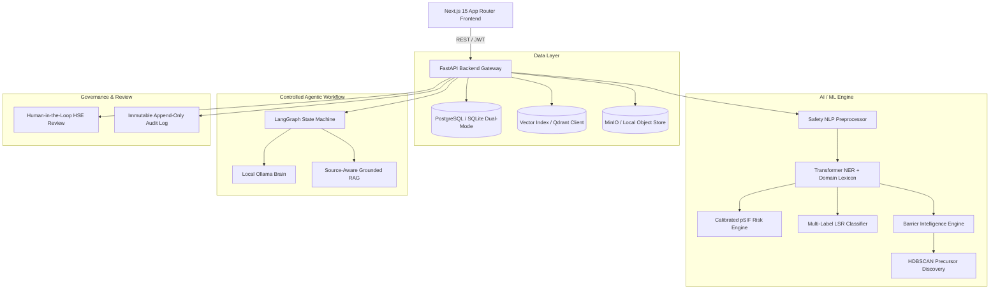

# SurakshaAI — System Architecture

## Architectural Principles

1. **Decoupled Responsibilities**:
   - Web Frontend: Information-dense, light-themed operational UI (React, Tailwind, Lucide, Recharts).
   - Backend Gateway: High-performance typed REST API in FastAPI with Argon2id and JWT authentication.
   - Deterministic ML: Scikit-learn calibrated gradient-boosted ensembles for rare-event pSIF classification.
   - Local Brain: Ollama private LLM for grounded contextual explanations and summarization.
2. **Offline & Degraded Fault Tolerance**:
   - If Ollama is offline or uninstalled, the application operates in **Degraded Mode** without interruption.
   - If Docker/Postgres/Qdrant are absent, the application runs seamlessly via embedded SQLite and local vector indexing.
3. **Data Leakage Prevention**:
   - Predictions strictly utilize information available at initial triage time (narrative, site, equipment, direct observation). Post-investigation root causes are excluded from the initial prediction task.
